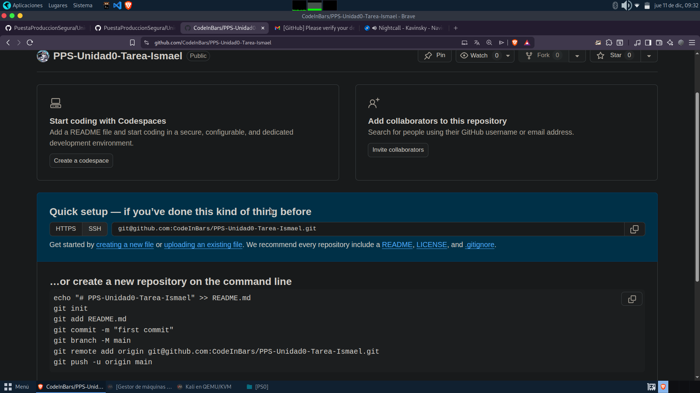
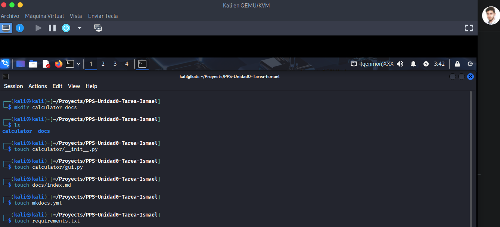

# GIT
---

En esta ocasión realicé la creación del repositorio a través de la interfaz de github

Aunque toda la estructura fue creada a través de comandos para posteriormente hacer un commit y subirlo a la rama main

