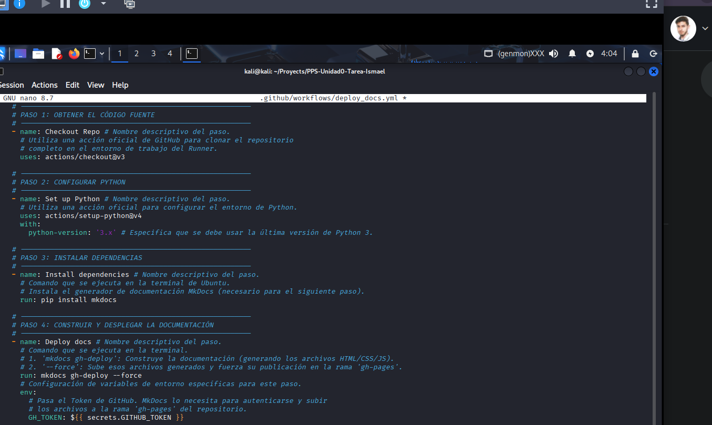
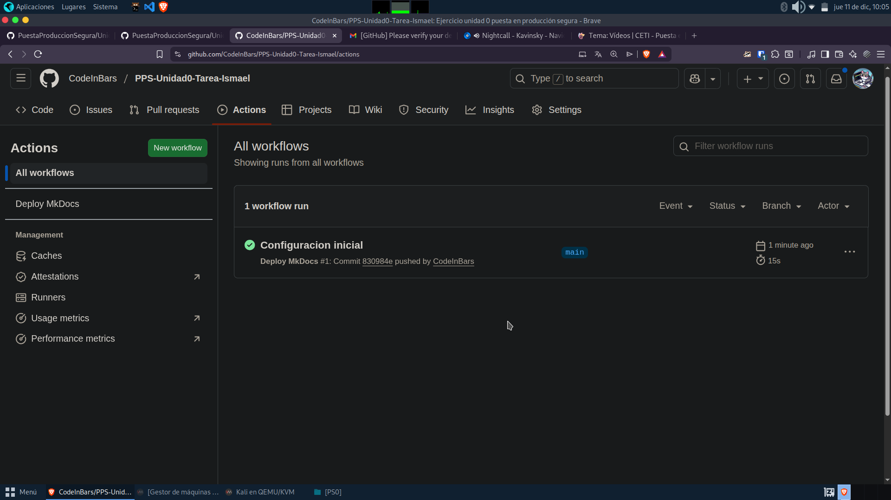

# GitActions

Para realizar el apartado del workflow se ha seguido el ejercicio anterior modificando posteriormente el mkdocs
Adjunto las pantallas del mkdocs inicial y del deploy:

Posteriormente se comprobó si el deploy funcionaba correctamente

Una vez probado, se volvió a modificar el mkdocs para que siguiera la estructura deseada

