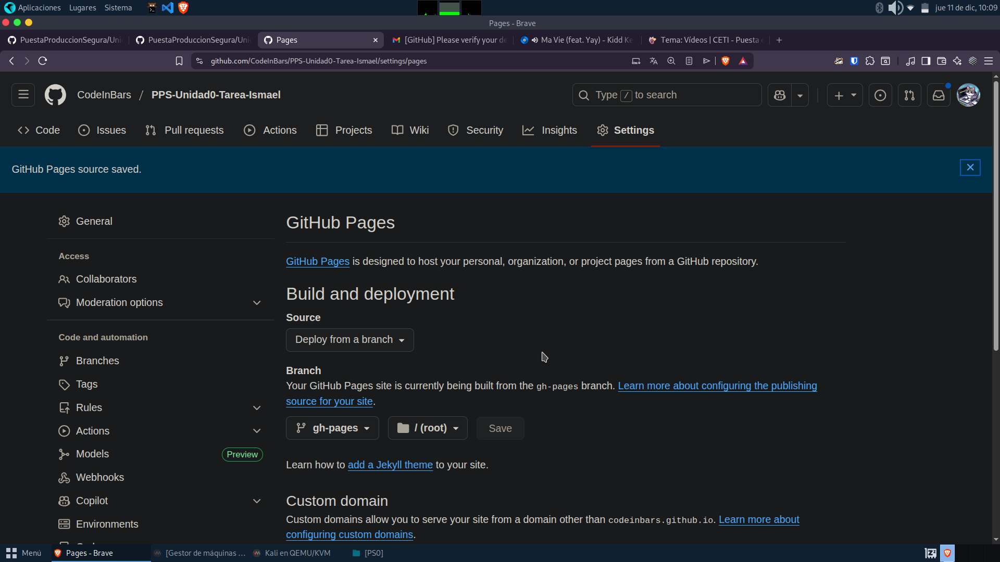
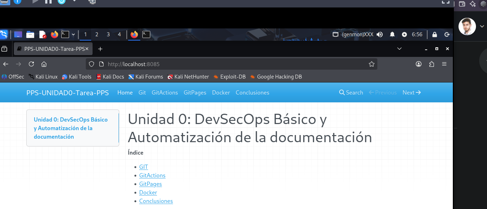

# Git Pages

En este paso tuve un pequeño problema debido a que en el proceso de la tarea decidí cambiar la visualización del repositorio a private, 
lo que ocasionó que Pages de git quedara inhabilitado. 

La configuración de este apartado fue realmente sencilla, lo único que tuve que hacer fue entrar a la configuración del repositorio y activar
github pages para la rama deseada.

Una vez desplegado y realizado los cambios de [MKDocs](gitActions.md) el resultado obtenido fue el siguiente

